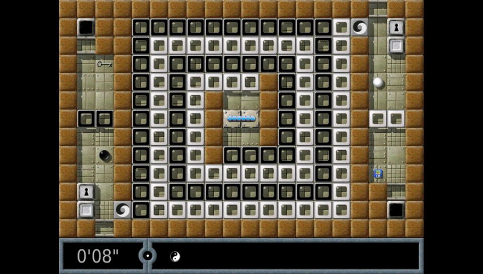

Overview
=====
This is my Vita port of Enigma, a skill/puzzle game inspired by Oxyd on the Atari ST and Rock'n'Roll on the Amiga.



The object of the game is to uncover pairs of identically colored Oxyd stones. Simple? Yes. Easy? Certainly not! Hidden traps, vast mazes, laser beams, and, most of all, countless hairy puzzles usually block your direct way to the Oxyd stones … If you are new to Enigma, you may want to take a look at a few [screenshots](http://www.nongnu.org/enigma/screenshots.html) or peek at the [user manual](http://www.nongnu.org/enigma/manual_1.20/manual/enigma.html).

Homepage
======
Detailed information about the game can be found here:
http://www.nongnu.org/enigma/index.html

Thanks
======
Thanks to my supporters on Patreon: Andyways, CountDuckula, and Sean Ritzo.

Thanks to @usineur for his libkbd-vita code for easy use of touch keyboard text entry.

Thanks to the developers of VitaSDK and other developers on the Vita for making this possible, in no particular order: @devnoname120, @TheOfficialFlow, @yifanlu, @Rinnegatamante, @cpasjuste, @xyzz, @xerpi, and many others.

Thanks to the many developers of the original game, such as the main developers Thomas Bernhardt, Raoul Bourquin, Siegfried Fennig, Martin Hawlisch, Daniel Heck, Ronald Lamprecht, Andreas Lochmann, Petr Machata, Nobby, Nat Pryce, Jacob Scott, Sven Siggelkow, Ralf Westram, and many many others.

The full credits are at http://www.nongnu.org/enigma/credits.html .

Special thanks to Meinolf Schneider / Amekudzi for the original Oxyd games on Atari ST and PC which inspired Enigma.

Installation Instructions
=====
- Install the .vpk
- Extract the contents of data.zip into ux0:data/

NOTE: I recommend using FTP transfer to copy the files over (~10,000 small files in data.zip). There is one report (thanks @ji11x38) that using the Vitashell "SELECT Button: USB" option to copy files directly from a MacOS computer to the Vita via USB caused the files to not transfer correctly, causing Enigma to crash on startup.

Vita-exclusive features
=====
- game controller support: analog joystick mouse controls and button mappings
- front and rear touch controls with left/right mouse click gestures
- complete level packages with >3,000 levels and pre-calculated preview screenshots
- Bluetooth keyboard and mouse combo support (Vita supports only a limited number of BT devices, tested working with Jelly Bean BT keyboard and mouse combo ASIN:B06Y56BBYP and with the standalone Jelly Comb Bluetooth Wireless Mouse ASIN:B075HBDWCF)
 
Vita Controls (controls updated with version 1.08)
=====
Left analog stick = analog control of the marble and mouse pointer  
Square / L-trigger = select menu items, use object in game (left mouse button)  
Triangle / R-trigger = cycle through inventory items (right mouse button)  
Cross = ok in menu (return)  
Circle = back / in-game menu (escape key)  
Start = help screen (F1)  
Select = destroy marble and remove one life (F3)  
R-trigger + Select = restart level (shift-F3)  

Dpad in menu = quick-select menu items (arrow keys)  
Dpad left/right in game = quick-change mouse speed  
Dpad up/down in game = cycle through previous messages  

Front touch = analog control of the marble and mouse pointer  
Rear touch = analog control of the marble and mouse pointer  
Single finger tap = select menu items, use object in game (left mouse button)  
Dual finger tap = cycle through inventory items (right mouse button)  

Dual finger tap works by holding one finger down and quickly tapping with a second finger somewhere else.

Mouse sensitivity can be adjusted in options or in-game via dpad left/right. The setting affects analog joystick, touch, and real bluetooth mice.

Build Instructions
=====
Enigma needs xerces-c and inet. To prepare compilation:

- with a text-editor, load the file $VITASDK/arm-vita-eabi/include/netinet/in.h. Inside the file, replace "struct"  with "inline struct" on line 45 and 49.
- download or clone my xerces-c repo from [here](https://www.github.com/rsn8887/xerces-c) into a folder called xerces
````
mkdir build
cd build
cmake -DCMAKE_TOOLCHAIN_FILE=$VITASDK/share/vita.toolchain.cmake -Dmutex-manager=nothreads -Dnetwork=OFF -DCMAKE_BUILD_TYPE=Release -Dsse2=OFF -Dthreads=OFF -DBUILD_SHARED_LIBS=OFF ../xerces/

make -j10
make install -j10
````
You should now have the file 
````
$VITASDK/arm-vita-eabi/lib/libxerces-c.a 
````
and a whole bunch of header files in 
````
$VITASDK/arm-vita-eabi/include/xercesc/
````
- Clone the Enigma repo into a folder called Enigma and compile
````
mkdir build
cd build
cmake -DCMAKE_BUILD_TYPE=Release ../Enigma
make enigma.vpk -j10
````

Changelog
=====
1.10

- Improve response to slow finger motion

1.09

- Improve controls with bluetooth mouse by re-compiling with latest SDL-Vita

1.08

- Improve keymap, map left/right mouse buttons also to L/R for better playability. 

1.07

- prevent accidental clicks when moving marble using touch

1.06

- map dpad as arrow keys to quick select menu items and quick-select mouse speed in game
- map L to 'F1' (help), X to 'Return' (ok), O to 'ESC' (back)
- update help texts to reflect Vita controller mappings

1.05

- enable touch keyboard in menu, useful for name entry and level search
- increase smoothness of mouse pointer motion in gui
- remove the missing translations

1.04

- fix missing soundsets in audio menu

1.03

- updated data.zip to include many more levels with corresponding thumbnail previews and many more sound sets. 

1.02

- decrease default joystick sensitivity (marble moved too fast when controlled with joystick)

1.01

- map r-trigger to 'restart' and select button to 'kill marble'

1.00

- initial Vita port release based on latest Enigma development version
